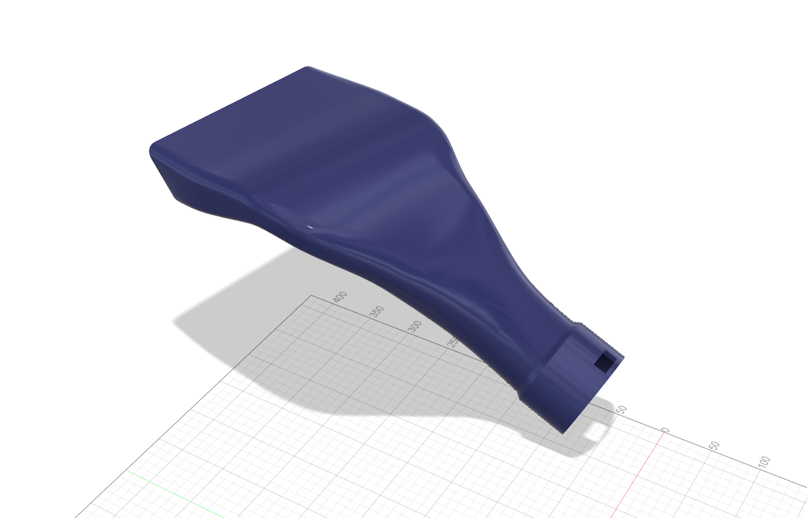
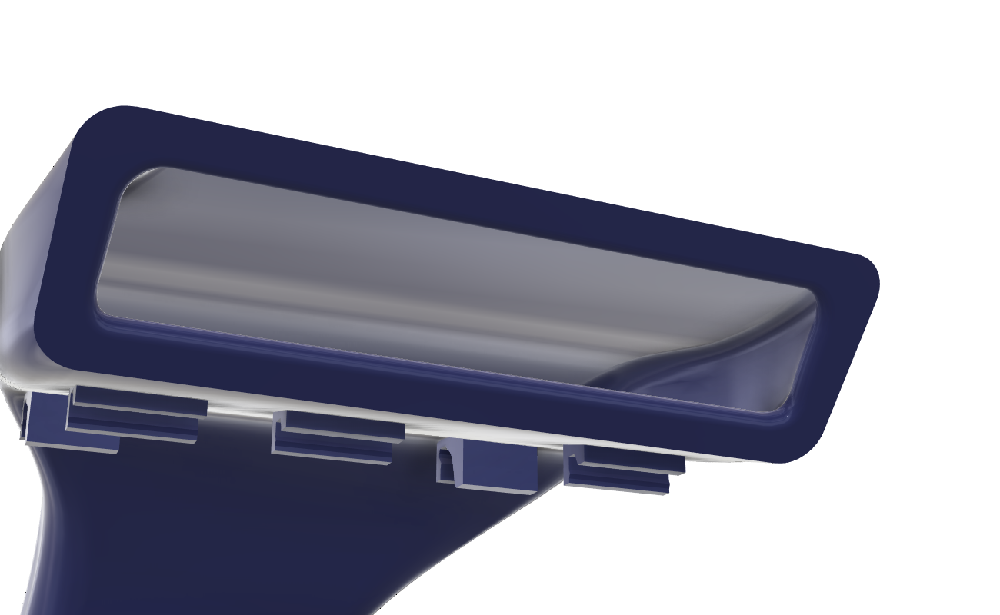
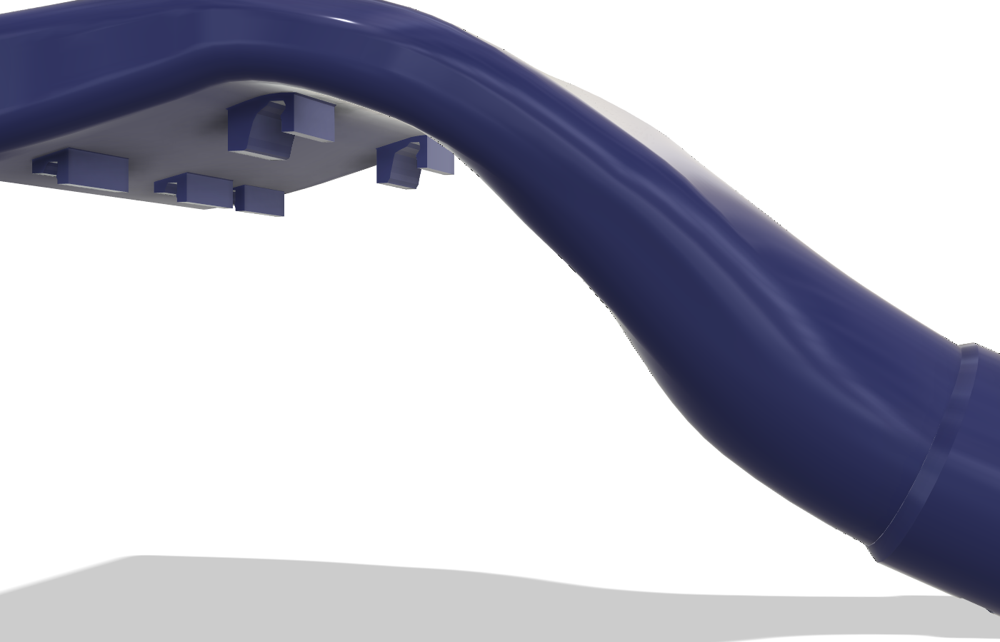
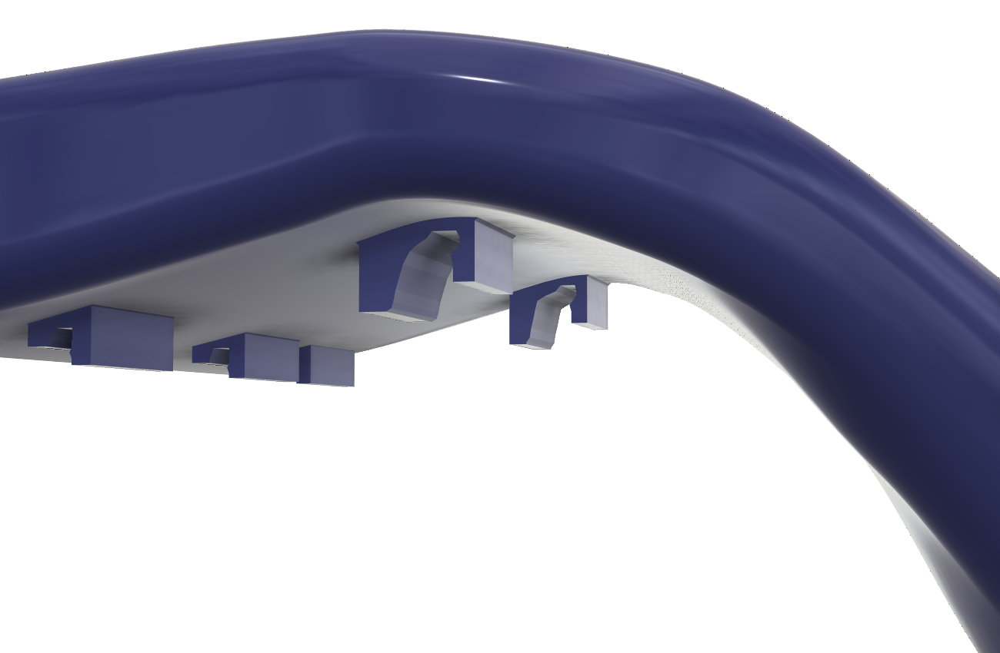
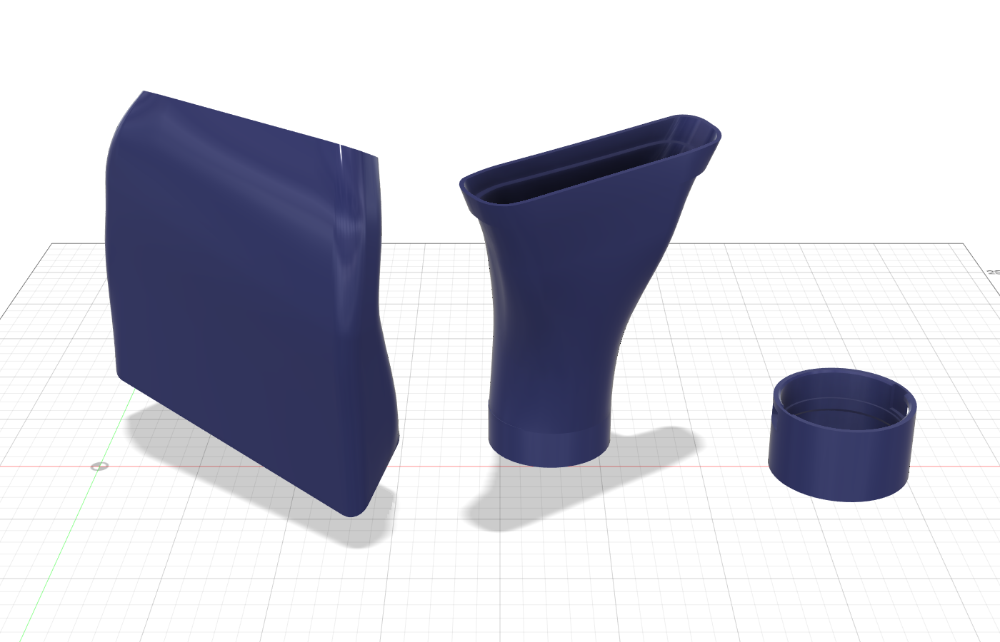

# Citroën Cold Air Intake Flange

A 3D-printable cold air intake duct for a Citroën engine bay. It takes air from the
radiator cross-member (a rectangular opening cut into the raised plastic bump in front of
the hood-seal lip) and delivers it through a bayonet socket to the OEM corrugated hose
(bellows) that plugs into the air-filter box.

The shape was designed in Autodesk Fusion against a photogrammetry scan of the engine bay,
scaled from the known Ø63 mm filter inlet, and checked for collisions with the scan.

## Repository layout

| Path | Contents |
|---|---|
| `model/` | Final assembled part (`.f3d`, `.step`, `.stl`) in car coordinates |
| `parts/` | The three print parts, already oriented for printing (`.stl`, `.step`, `.f3d`) |
| `print/` | Fusion print layout with all three parts on the bed |
| `references/flange_scan/` | 3D scan (OBJ) of the OEM bayonet flange used as the pattern for the outlet socket |
| `references/bellows_scan/` | 3D scan (OBJ) of the OEM corrugated hose (bellows) |
| `images/` | Renders |

All STL files are in millimetres. The full-resolution Part 1 and Part 2 STLs (≈ 135 / 55 MB,
0.01 mm chord tolerance) are too large for the repository, so they are stored zipped as
`parts/Part1_mouth_clips.stl.zip` and `parts/Part2_bend_tube.stl.zip`.

## Design summary

| Feature | Value |
|---|---|
| Inlet (mouth) | 160 × 45 mm (R9 corners) on the flat part of the rear wall of the cross-member bump, centred on it; window 140 × 25 mm (≈ 35 cm²) |
| Mounting face | Planar land offset 1 mm from the bump wall for 1 mm double-sided tape; land 10 mm wide all round, entirely on the flat wall (no part of it on the top radius) |
| Inlet edge | Sharp edge; the inner walls run as straight ramps from the window to the duct over the seal lip |
| Wall thickness | 2.5 mm (wedge up to 10 mm at the mouth land) |
| Shape | Straight entry over the floor rib and the hood-seal lip (flat floor 3 mm above the lip), then one smooth bend down in which the section blends into a Ø63 tube, a straight Ø63 section (collar joint) and a short R55 bend onto the bellows-flange axis. Plan view: smooth trumpet 160 → ≈ 131 mm over the lip → Ø63. Narrowest section of the whole intake is the Ø54 ring of the bayonet flange (22.9 cm²); the duct over the lip is ≈ 23.5 cm² |
| Outlet | Separate bayonet flange (Part 3) on the Ø63 spigot, fitted to the measured bellows cuff with every diameter 1 mm larger than the cuff: OD 73 mm, height 46 mm; spigot sleeve Ø63.3 × 10 mm → 45° cone → Ø54 ring (flush with the cuff bore) → cuff stop → Ø62 → R4 shoulder → Ø64 up to the rim; two through windows 29° × 10 mm, two entry grooves (to Ø68) from the rim down to the windows, 30° twist; twist-lock counter-clockwise viewed into the filter inlet |
| Spigot / flange joint | The Part 2 bore narrows from Ø58 to Ø54 inside the spigot along an S-curve of two tangent R38.8 arcs (no kinks); the spigot tip is a 45° cone that seats on the flange cone, so the flow path is a continuous Ø54 from Part 2 through the flange ring into the bellows cuff, with no step or gap |
| Bellows fit | OEM bellows cuff (measured): end Ø59 with R1 edge, sealing bead Ø61, Ø60, R4 shoulder, Ø63, wall 2.5 mm (bore Ø54); two wedge lugs 15 mm wide × 9 mm long, rising to 2.5 mm (Ø67) at the back, 26 mm from the cuff end. Clearance 0.5 mm per side radially and around the lugs, 0.5 mm axial lug play. Free length ≈ 146 mm, fully compressed ≈ 109 mm; the rim position in the car is unchanged, the cuff stop is 1 mm closer to the filter than in the previous flange |
| Bellows position | Flange rim 81 mm from the filter-inlet rim (bellows close to its free length), bellows bend 25° |
| Collar joint | On the straight Ø63 section: the Part 2 collar (ID 63.3, OD 67.3, 10 mm) slides over the Part 1 tube end, butt joint with a flush Ø58 bore, 25° cone from the collar to the tube |
| Clip | One snap saddle (26 mm wide) on the hood-seal lip at the mouth centre; the floor-rib clips of earlier versions were removed |

## Printing

Tested setup: Creality Ender 3 Pro (220 × 220 × 250 mm), **PETG** 1.75 mm.
PLA/PLA+ is not suitable under the hood (softens at 55–60 °C). PETG is fine at the
cross-member, especially with an external heat-reflective wrap. ASA/ABS or PA-CF are better
if you have an enclosed printer.

| Part | Size (mm) | Orientation (as exported) | Supports |
|---|---|---|---|
| `Part1_mouth_clips` | 160 × 194 × 142 | Tape land flat on the bed | Tree supports "everywhere" (≈ 50°): ≈ 40 cm² of near-flat ceiling inside the bend is not reachable from the plate |
| `Part2_bend_tube` | 67 × 84 × 92 | Spigot tip down (use a brim) | Few or none (≈ 9 cm² over 45°) |
| `Part3_bayonet_flange` | 73 × 73 × 46 | Base (spigot sleeve) down | None (45° cone under the stop ring, windows bridge ≈ 18 mm) |

The Cura profile used for the parts is `print/cura/Ender3Pro_PETG_CAI.curaprofile` (import it via
Preferences → Profiles → Import). Its +0.9 mm Z offset (`adhesion_z_offset`) needs the Z Offset
Setting plugin from the Cura Marketplace; adjust it to your own printer.

Suggested PETG settings: nozzle 240–245 °C, bed 80 °C (glue stick as release layer),
fan 30–40 %, 40–50 mm/s, 4 perimeters, 30 % gyroid. Add a modifier over the clip area with
100 % infill and 5–6 perimeters. Brim 5–8 mm for parts 1 and 2. Dry the filament if it is not
fresh. Total material ≈ 400 g.

Do not use modelled supports — let the slicer generate tree/organic supports, restricted to
"touching build plate" so nothing grows inside the duct. Z gap 0.2 mm.
For Part 1 set **Support Overhang Angle = 46°**: the Creality default (45°) flags a strip of the
inner duct wall that is exactly at 45° and a branch grows into the duct through the mouth; at 46°
the outer underside (45–50°) and the clip teeth are still supported, which also enlarges the
footprint on the bed.

### Fit test (optional)

`print/CAI_v22_fit_test_trim.stl` is a quick test piece cut from Part 1: the full mouth land
frame (12 mm deep), the floor up to just behind the saddle, and the saddle. It is exported with the
tape land flat on the bed (160 × 92 × 83 mm). Use the Cura profile
`print/cura/Ender3Pro_PETG_TEST_fit_v22.curaprofile` (0.28 mm layers, 3 walls, 0 % infill,
60 mm/s, tree supports from the plate at 60°, z-hop), ≈ 2–2.5 h. On the car, snap the saddle on and
check that the land sits ≈ 1 mm from the bump wall all round (the tape thickness).
(`print/Part1_fit_test.stl` is the test piece of the previous design.)

## Assembly and installation

1. Slide the collar of **Part 2** over **Part 1** (0.15 mm clearance, 10 mm overlap) and bond
   with epoxy or CA glue (acetone does not work on PETG).
2. Slide **Part 3** (bayonet flange) over the Ø63 spigot of Part 2 (0.15 mm radial clearance,
   10 mm overlap) until the conical spigot tip seats on the internal cone. It rotates freely.
3. Cut a rectangular opening in the rear wall of the cross-member bump, apply 1 mm
   double-sided silicone (or VHB) tape to the mouth land, and snap the saddle over the
   hood-seal lip.
4. Insert the bellows cuff into the flange with the lugs in the entry grooves, push it down to the
   stop ring and twist counter-clockwise so the lugs move into the windows. Do the same at the
   filter inlet, then rotate the flange to its final position and fix it to the spigot (glue or a
   small screw).

Check hood clearance above the seal lip on the car before final assembly.

## Notes

- The master Fusion file with the engine-bay scan is kept locally and is not published.
- v22 (current `parts/`): Parts 1 and 2 were redesigned against a new, true-size engine-bay scan
  (the first scan turned out ≈ 7.8 % oversized; confirmed with caliper measurements). Part 3 is
  unchanged. The renders in `images/`, `model/` and the notes below describe earlier versions.
- `model/` is the earlier design reference (166 mm mouth, integrated OD 69 socket). The printable
  `parts/` supersede it:
  - Parts 1 and 2 were regenerated from the loft sections with a 160 mm mouth and monotonically
    decreasing widths, the clips were re-fitted to the new walls, and the Part 2 collar (0.15 mm
    clearance, 2 mm wall, 10 mm overlap) and Ø63 spigot were rebuilt. Checked against the
    engine-bay scan: only the intended clip snap / floor contact points (≤ 0.35 mm), Part 2 is clear.
  - Part 3: the first version was too shallow (23 mm instead of 31.5 mm to the cuff stop) and its
    bore (Ø62) was too small for the bellows cuff; rebuilt to the measured OEM flange (Ø64 bore,
    Ø69 lug recesses). Same spigot sleeve and base plane; the rim end is 13 mm closer to the filter
    (≥ 12 mm clearance to the engine-bay scan).
  - Part 3 was rebuilt again from a hand-measured bellows cuff (all diameters +1 mm, wedge lugs
    with a cylindrical outer face), the spigot sleeve shortened from 15 to 10 mm, and the Part 2
    spigot given an internal Ø58 → Ø54 S-taper and a conical tip. Re-checked in the car
    assembly: Part 2 outside is unchanged, the flange rim is at the same position, no interference
    between parts or with the bellows, ≥ 12 mm to the engine-bay scan.
- Dimensions of the OEM flange and bellows come from the scans in `references/` and hand
  measurements; verify fit with a test print of a clip section before printing the full part.
